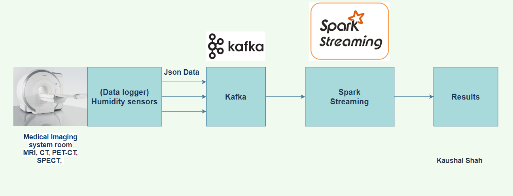

# Medical-imaging-system-datalogger-real-time-data-processing-and-analysis-using-spark-kafka




# 1. Overview
## Usecase
- Analyzing humidity from data loggers in real time to prevent major damage to critical medical imaging devices.(MRI, CT-SCAN, PETCT, SPECT)

## Project scenario
- Multiple dataloggers(hymidity sensors) are deployed in multiple medical imaging centers and hospitals
- Each data logger regularly sends humidity data to a Kafka server in HortonWorks  
- Kafka client retrieves the streaming data every 3 seconds
- PySpark processes and analyzes them in real-time by using Spark Streaming, and show the results

## Key Technologies
- Apache Spark (Spark Streaming)
- Apache Kafka
- Python/PySpark

# 2. Format of datalogger(humidity sensor) data

## Example- The data come from humidity sensor in form of json

```
{
    "guid": "0-ZZZ12345678-08K",#datalogger humidity sensor id
    "destination": "0-AAA12345678",#destination id
    "medicalImagingdevice": "MRI 12", # medical imaging device id which is located at imaging center or hospital
    "eventTime": "2022-08-16T13:26:39.447974Z", 
    "payload": {
        "format": "urn:example:sensor:humidity", 
        "data":{
            "humidity": 71.7
        }
    }
}
```
# 3. Analysis of Data
```
In this project, I achieved 4 types of real-time analysis.

(i) Average humidity by each medicalimagingdevice (Values sorted in descending order)
(ii)Total messages processed
(iii) Number of humidity sensors by each state (Keys sorted in ascending order)
(iv) Total number of sensors

```
## (i) Average humidity by each medicalImagingdevice (Values sorted in descending order)

```
avgHumidityByState = jsonRDD.map(lambda x: (x['medicalimagingdevice'], (x['payload']['data']['humidity'], 1))) \
             .reduceByKey(lambda a,b: (a[0]+b[0], a[1]+b[1])) \
             .map(lambda x: (x[0], x[1][0]/x[1][1])) 
sortedHumidity = avgHumidityByState.transform(lambda x: x.sortBy(lambda y: y[1], False))
sortedHumidity.pprint(num=100000)

```

{
    "guid":"0-ZZZ12345678-02X",
    "destination":"0-AAA12345678",
    "medicalimagingdevice":"PETCT10",
    "eventTime":"2022-07-30T11:45:09.235754Z",
    "payload":{
        "format":"urn:example:sensor:humidity",
        "data":{
            "humidity":58.2
            }
    }
}

## (ii) Total messages processed
```
# total number of messages
messageCount = jsonRDD.map(lambda x: 1) \
                     .reduce(add) \
                     .map(lambda x: "Total number of messages: "+ unicode(x))
messageCount.pprint()
```
## (iii) Number of sensors by each state (Keys sorted in ascending order)

```
# Number of humidity sensor at hospitals and imaging center
numSensorsBymedicaldevice = jsonRDD.map(lambda x: (x['medicalimagingdevice'] + ":" + x['guid'], 1)) \
                    .reduceByKey(lambda a,b: a*b) \
                    .map(lambda x: (re.sub(r":.*", "", x[0]), x[1])) \
                    .reduceByKey(lambda a,b: a+b)
sortedSensorCount = numSensorsBymedicaldevice.transform(lambda x: x.sortBy(lambda y: y[0], True))
sortedSensorCount.pprint(num=10000)
```
## (iv) Total number of sensors
```

# total number of devices
sensorCount = jsonRDD.map(lambda x: (x['guid'], 1)) \
                     .reduceByKey(lambda a,b: a*b) \
                     .map(lambda x: 1) \
                     .reduce(add) \
                     .map(lambda x: "Total number of sensors: " + unicode(x))
sensorCount.pprint(num=10000)

```

# 4. Results

```
-------------------------------------------
Time: 2022-07-30 01:09:03

-------------------------------------------

-------------------------------------------
Time: 2022-07-30 01:09:06

-------------------------------------------

-------------------------------------------
Time: 2022-07-30 01:09:09

-------------------------------------------

-------------------------------------------
Time: 2022-07-30 01:09:12

-------------------------------------------

-------------------------------------------
Time: 2022-07-30 01:09:15   <- Average temperature by each state (Values sorted in descending order)
-------------------------------------------
-------------------------------------------
(u'PETCT7', 70.81361502347417)
(u'PETCT6', 69.25660377358493)
(u'CT1', 66.64378698224857)
(u'PETCT12', 64.06748768472902)
(u'MRI5', 63.5295081967213)
(u'MRI1', 63.48599033816421)
(u'LINAC3', 63.39398907103824)
(u'LINAC4', 62.46274509803922)
(u'MRI2', 60.574556213017765)
(u'MRI9', 60.19908675799086)
(u'CT8', 60.11951219512194)
(u'MRI8', 58.97126436781611)
(u'CT2', 58.962244897959174)
(u'PETCT3', 58.865938864628845)
(u'CT5', 57.83787878787876)
(u'LINAC5', 55.43532934131735)
(u'PETCT2', 55.31930693069307)
(u'SPECT5', 54.994054054054075)
(u'SPECT1', 54.88229665071771)
(u'LINAC1', 54.54745762711863)
(u'CT10', 54.231004366812265)
(u'PETCT10', 53.14876543209874)
(u'MRI6', 53.04600000000002)
(u'PETCT11', 52.86069364161848)
(u'PETCT5', 51.927272727272744)
(u'MRI4', 51.76022727272727)
(u'SPECT8', 50.2936585365854)
(u'SPECT3', 50.092156862745156)
(u'CT9', 49.874400000000016)
(u'CT7', 49.11515151515152)
(u'CT4', 49.101863354037285)
(u'LINAC6', 48.6443181818182)
(u'MRI11', 48.435555555555545)
(u'SPECT4', 48.19802955665024)
(u'PETCT1', 47.87729729729728)
(u'SPECT2', 47.76611570247935)
(u'MRI7', 47.41428571428573)
(u'LINAC7', 45.2108225108225)
(u'SPECT7', 45.19899497487435)
(u'CT11', 44.707798165137646)
(u'CT6', 44.5754010695187)
(u'MRI10', 44.08815789473686)
(u'PETCT9', 43.603720930232555)
(u'PETCT4', 43.05329341317365)
(u'LINAC2', 42.77888888888891)
(u'MRI3', 42.27473684210525)
(u'PETCT8', 42.23756097560975)
(u'MRI12', 41.05793650793651)
(u'CT3', 40.38625592417063)
(u'SPECT6', 40.189839572192476)
(u'CT12', 26.311282051282056)

-------------------------------------------
Time: 2022-07-30 01:09:18 <- Total messages processed
-------------------------------------------
Total number of messages: 10000

-------------------------------------------
Time: 2022-07-30 01:09:21 <- Number of humidity sensors at hospital and imaging center (Keys sorted in ascending order)
-------------------------------------------
(u'CT1', 36)
(u'CT10', 48)
(u'CT11', 42)
(u'CT12', 40)
(u'CT2', 39)
(u'CT3', 42)
(u'CT4', 35)
(u'CT5', 29)
(u'CT6', 39)
(u'CT7', 37)
(u'CT8', 49)
(u'CT9', 51)
(u'LINAC1', 38)
(u'LINAC2', 41)
(u'LINAC3', 37)
(u'LINAC4', 41)
(u'LINAC5', 37)
(u'LINAC6', 37)
(u'LINAC7', 48)
(u'MRI1', 41)
(u'MRI10', 43)
(u'MRI11', 35)
(u'MRI12', 50)
(u'MRI2', 38)
(u'MRI3', 44)
(u'MRI4', 43)
(u'MRI5', 36)
(u'MRI6', 36)
(u'MRI7', 40)
(u'MRI8', 40)
(u'MRI9', 43)
(u'PETCT1', 37)
(u'PETCT10', 34)
(u'PETCT11', 37)
(u'PETCT12', 46)
(u'PETCT2', 45)
(u'PETCT3', 48)
(u'PETCT4', 33)
(u'PETCT5', 43)
(u'PETCT6', 37)
(u'PETCT7', 43)
(u'PETCT8', 44)
(u'PETCT9', 46)
(u'SPECT1', 45)
(u'SPECT2', 48)
(u'SPECT3', 41)
(u'SPECT4', 39)
(u'SPECT5', 40)
(u'SPECT6', 40)
(u'SPECT7', 40)
(u'SPECT8', 39)

-------------------------------------------
Time: 2022-07-30 01:09:15  <- Total number of sensors
-------------------------------------------
Total number of sensors: 2086

```

# Steps

## Step 1 - creating kafka topic
```
/usr/hdp/current/kafka-broker/bin/kafka-topics.sh --create --zookeeper localhost:2181 --replication-factor 1 --partitions 1 --topic humidityanalytics
# checking topic is created 
/usr/hdp/current/kafka-broker/bin/kafka-topics.sh --list --zookeeper localhost:2181
```
## Step 2 - Starting spark shell
```
pyspark --jars /root/medical/spark-streaming-kafka-0-8-assembly_2.11-2.4.7.jar
Run the spark code [kafka-direct-iotmsg.py]
```
## Step 3 - Sending sensor data to kafka using console producer
```
/usr/hdp/current/kafka-broker/bin/kafka-console-producer.sh --broker-list 172.18.0.2:6667 --topic humidityanalytics < midata.txt
```


